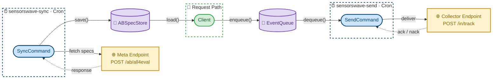
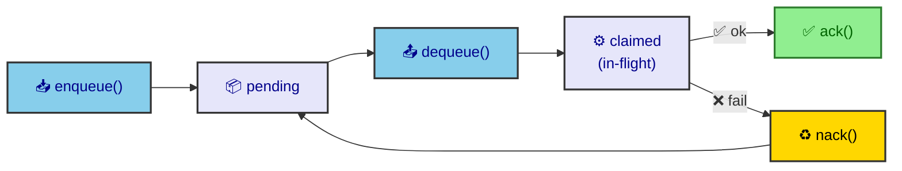

# SensorsWave PHP SDK

[](https://github.com/sensorswave/sdk-php/releases)
[](https://www.php.net/)
[](https://github.com/sensorswave/sdk-php/actions/workflows/test.yml)
[](https://github.com/sensorswave/sdk-php/actions/workflows/lint.yml)
[](https://github.com/sensorswave/sdk-php/actions/workflows/security.yml)
[](https://github.com/sensorswave/sdk-php/blob/master/LICENSE)

**English** | [中文](README.zh-CN.md)

A lightweight PHP SDK for event tracking and A/B testing, designed for PHP/FPM environments.

## Features

- **Event Tracking**: Track user events with custom properties
- **User Profiles**: Set, increment, append, and manage user profile properties
- **A/B Testing**: Evaluate feature gates, experiments, and feature configs from local snapshots
- **Automatic Exposure Logging**: Automatically track A/B test impressions
- **Offline Runtime**: Zero remote I/O on the request path — all network operations run out of band
- **Pluggable Adapters**: Local file adapters by default, with Redis adapter support

## Installation

```bash
composer require sensorswave/sdk-php
```

## Runtime Model

The PHP SDK separates request-path logic from network I/O, making it safe for PHP/FPM:

- **Request path** — `Client` reads A/B snapshots from `ABSpecStore` and writes tracking payloads to `EventQueue`. No remote calls.
- **`sensorswave-sync`** — Worker that pulls remote A/B metadata and saves snapshots locally.
- **`sensorswave-send`** — Worker that reads queued events and delivers them to the collector.

By default, the SDK uses local file adapters under `sys_get_temp_dir()`. You can replace them with Redis-backed adapters by implementing the `RedisClientInterface`.



---

## Quick Start

### Basic Event Tracking

```php
<?php

declare(strict_types=1);

use SensorsWave\Client\Client;
use SensorsWave\Model\User;

// Create client with minimal configuration
$client = Client::create(
    'https://your-endpoint.com',
    'your-source-token',
);

// Track events
$user = new User(anonId: 'device-456', loginId: 'user-123');

$client->trackEvent($user, 'PageView', [
    'page' => '/home',
]);

$client->close();
```

### Enable A/B Testing (Optional)

To enable A/B testing, provide an `ABConfig`:

```php
use SensorsWave\Config\Config;
use SensorsWave\Config\ABConfig;

$config = new Config(
    ab: new ABConfig(
        projectSecret: 'your-project-secret',
    ),
);

$client = Client::create(
    'https://your-endpoint.com',
    'your-source-token',
    $config,
);

// Now you can use A/B testing methods
$result = $client->getExperiment($user, 'my_experiment');

// Get parameters from the experiment result
$btnColor = $result->getString('button_color', 'blue');
$showBanner = $result->getBool('show_banner', false);
$discount = $result->getNumber('discount_percent', 0);
```

### Run Workers Out of Band

Sync A/B snapshots on a schedule (e.g. via cron):

```bash
./bin/sensorswave-sync <endpoint> <sourceToken> <projectSecret>
```

Send queued events on a schedule:

```bash
./bin/sensorswave-send <endpoint> <sourceToken>
```

---

## User Type

> **Warning**
>
> ### User Identity Requirements (MUST READ)
>
> **For ALL methods EXCEPT `identify`:**
>
> - At least one of `anonId` or `loginId` must be non-empty
> - **If both are provided, `loginId` takes priority for user identification**
>
> **For the `identify` method ONLY:**
>
> - **Both `anonId` AND `loginId` must be non-empty**
> - This creates a `$Identify` event linking anonymous and authenticated identities

### Usage Examples

**Creating users with different ID combinations:**

```php
use SensorsWave\Model\User;

// Valid: loginId only (for logged-in users)
$user = new User(loginId: 'user-123');

// Valid: anonId only (for anonymous users)
$user = new User(anonId: 'device-456');

// Valid: Both IDs (loginId takes priority for identification)
$user = new User(anonId: 'device-456', loginId: 'user-123');

// INVALID: Neither ID provided - this will FAIL
$user = new User();
```

**For the identify method - both IDs are REQUIRED:**

```php
// Correct: Both IDs provided
$client->identify(new User(anonId: 'device-456', loginId: 'user-123'));

// INVALID: Only one ID - identify will FAIL
$client->identify(new User(loginId: 'user-123')); // Missing anonId
```

**Adding A/B targeting properties:**

```php
$user = new User(anonId: 'device-456', loginId: 'user-123');

// Add A/B targeting properties (immutable pattern)
$user = $user->withAbUserProperty('$app_version', '11.0');
$user = $user->withAbUserProperty('is_premium', true);

// Or add multiple properties at once
$user = $user->withAbUserProperties([
    '$app_version' => '11.0',
    'is_premium'   => true,
]);
```

---

## Event Tracking

### Identify User

Links an anonymous ID with a login ID (sign-up event).

```php
$user = new User(anonId: 'anon-123', loginId: 'user-456');
$client->identify($user);
```

### Track Custom Event

```php
$user = new User(anonId: 'anon-123', loginId: 'user-456');

$client->trackEvent($user, 'Purchase', [
    'product_id'   => 'SKU-001',
    'total_amount' => 99.99,
    'item_count'   => 2,
]);
```

### Track with Full Event Structure

```php
use SensorsWave\Model\Event;
use SensorsWave\Model\Properties;

$event = Event::create('anon-123', 'user-456', 'PageView')
    ->withProperties(
        Properties::create()
            ->set('page_name', '/home')
            ->set('referrer', 'google.com')
    );

$client->track($event);
```

---

## User Profile Management

### Set Profile Properties

```php
$user = new User(anonId: 'anon-123', loginId: 'user-456');

$client->profileSet($user, [
    'name'             => 'John Doe',
    'email'            => 'john@example.com',
    'membership_level' => 5,
]);
```

### Set Once (Only if Not Exists)

```php
$client->profileSetOnce($user, [
    'first_login_date' => '2026-01-20',
]);
```

### Increment Numeric Properties

```php
$client->profileIncrement($user, [
    'login_count' => 1,
    'points'      => 100,
]);
```

### Append to List Properties

```php
use SensorsWave\Model\ListProperties;

$client->profileAppend($user, ListProperties::create()->set('tags', ['premium']));
```

### Union List Properties

```php
$client->profileUnion($user, ListProperties::create()->set('categories', ['sports']));
```

### Unset Properties

```php
$client->profileUnset($user, 'temp_field', 'old_field');
```

### Delete User Profile

```php
$client->profileDelete($user);
```

---

## A/B Testing

The PHP client evaluates A/B tests from local snapshots only. If the snapshot is missing or stale, gate checks fail closed. The client never falls back to remote metadata refresh on the request path.

### Check Feature Gate

```php
$pass = $client->checkFeatureGate($user, 'new_checkout_flow');
if ($pass) {
    showNewCheckout();
} else {
    showOldCheckout();
}
```

### Get Feature Config Values

```php
$result = $client->getFeatureConfig($user, 'button_color_config');

// Get typed values with fallback
$color   = $result->getString('color', 'blue');
$size    = $result->getNumber('size', 14.0);
$enabled = $result->getBool('enabled', false);
$items   = $result->getSlice('items', []);
$settings = $result->getMap('settings', []);
```

### Evaluate Experiment

```php
$result = $client->getExperiment($user, 'pricing_experiment');

$strategy = $result->getString('strategy', 'original');

switch ($strategy) {
    case 'original':
        showOriginalPricing();
        break;
    case 'discount':
        showDiscountPricing();
        break;
    case 'bundle':
        showBundlePricing();
        break;
}
```

---

## Complete API Method Reference

### Lifecycle Management

| Method | Signature | Description |
|--------|-----------|-------------|
| **close** | `close(): void` | Flush in-memory events into the local queue and close the client |
| **flush** | `flush(): void` | Flush the current buffered batch into the local queue without closing |

### User Identity

| Method | Signature | Description |
|--------|-----------|-------------|
| **identify** | `identify(User $user): void` | Creates a `$Identify` event linking anonymous and authenticated identities. Both `anonId` and `loginId` are required. |

### Event Tracking

| Method | Signature | Description |
|--------|-----------|-------------|
| **trackEvent** | `trackEvent(User $user, string $eventName, array\|Properties $properties = []): void` | Primary method for tracking user actions with custom properties |
| **track** | `track(Event $event): void` | Low-level API for advanced scenarios; prefer `trackEvent` for normal usage |

### User Profile Operations

| Method | Signature | Description | Use Case |
|--------|-----------|-------------|----------|
| **profileSet** | `profileSet(User $user, array\|Properties $properties): void` | Sets or overwrites profile properties | Update user name, email, settings |
| **profileSetOnce** | `profileSetOnce(User $user, array\|Properties $properties): void` | Sets properties only if they don't exist | Record registration date, first source |
| **profileIncrement** | `profileIncrement(User $user, array\|Properties $properties): void` | Increments numeric properties | Login count, points, score |
| **profileAppend** | `profileAppend(User $user, array\|ListProperties $properties): void` | Appends to list properties (allows duplicates) | Add purchase history, activity log |
| **profileUnion** | `profileUnion(User $user, array\|ListProperties $properties): void` | Adds unique values to list properties | Add interests, tags, categories |
| **profileUnset** | `profileUnset(User $user, string ...$propertyKeys): void` | Removes specified properties | Clear temporary or deprecated fields |
| **profileDelete** | `profileDelete(User $user): void` | Deletes entire user profile (irreversible) | GDPR data deletion requests |

### A/B Testing

| Method | Signature | Description |
|--------|-----------|-------------|
| **checkFeatureGate** | `checkFeatureGate(User $user, string $key): bool` | Evaluates a feature gate. Returns `false` if key not found or wrong type |
| **getFeatureConfig** | `getFeatureConfig(User $user, string $key): ABResult` | Evaluates a feature config. Returns empty result if key not found |
| **getExperiment** | `getExperiment(User $user, string $key): ABResult` | Evaluates an experiment. Returns empty result if key not found |
| **evaluateAll** | `evaluateAll(User $user): array` | Evaluates all loaded specs and queues impressions |
| **getABSpecs** | `getABSpecs(): string` | Exports current A/B metadata snapshot as JSON for caching |

---

## Configuration Options

### Client Config

| Field | Type | Default | Description |
|-------|------|---------|-------------|
| `trackUriPath` | `string` | `/in/track` | Event tracking endpoint path |
| `flushIntervalMs` | `int` | `10000` | In-memory batch rollover interval (ms) |
| `httpConcurrency` | `int` | `1` | Worker-side request concurrency |
| `httpTimeoutMs` | `int` | `3000` | Worker-side request timeout (ms) |
| `httpRetry` | `int` | `2` | Worker-side retry attempts |
| `eventQueue` | `EventQueueInterface` | Local file queue ⚠️ | Queue used by request-path tracking APIs |
| `onTrackFailHandler` | `?callable` | `null` ⚠️ | Failure callback when queue writes fail |
| `ab` | `?ABConfig` | `null` | A/B configuration (disabled by default) |
| `transport` | `?TransportInterface` | `null` | Worker-side custom transport |
| `logger` | `?LoggerInterface` | Default logger ⚠️ | Custom logger |

> ⚠️ **Production Notice**
>
> The following fields ship with minimal default implementations intended for local development and testing only. They are **not recommended for production use** — you should provide your own implementations:
>
> - **`eventQueue`** — Default `LocalFileEventQueue` uses the system temp directory. In multi-instance or containerized deployments, each process has its own isolated queue, and data may be lost on restart. Replace with a shared backend (e.g. Redis, database).
> - **`onTrackFailHandler`** — Default `null` silently discards failures. In production you should register a callback to log or alert on queue write errors, otherwise data loss goes unnoticed.
> - **`logger`** — Default `DefaultLogger` only outputs `warn` and `error` to `error_log`, with `debug` and `info` silenced. Replace with your logging framework (e.g. Monolog) for full observability.

### ABConfig

| Field | Type | Default | Description |
|-------|------|---------|-------------|
| `projectSecret` | `string` | `''` | Project secret used by the sync worker |
| `metaEndpoint` | `string` | Main endpoint | Metadata endpoint override for the sync worker |
| `metaUriPath` | `string` | `/ab/all4eval` | Metadata request path |
| `metaLoadIntervalMs` | `int` | `60000` | Snapshot freshness threshold (minimum `30000`) |
| `stickyHandler` | `?StickyHandlerInterface` | `null` | Sticky assignment storage |
| `loadABSpecs` | `string` | `''` | Bootstrap snapshot payload |
| `abSpecStore` | `ABSpecStoreInterface` | Local file store ⚠️ | Snapshot store used by the request path |

> ⚠️ **Production Notice**
>
> - **`abSpecStore`** — Default `LocalFileABSpecStore` stores snapshots in the system temp directory. In multi-instance or containerized deployments, each process reads its own isolated copy, leading to inconsistent A/B evaluations. Replace with a shared backend (e.g. Redis, database).

---

## Advanced: Caching A/B Specs

To improve startup performance, you can cache the A/B specifications and load them upon client initialization.

```php
// 1. Get specs from an initialized client
$specs = $client->getABSpecs();

// 2. Save specs to persistent storage (e.g. file, database, Redis)
// saveToStorage($specs);

// 3. Load specs when creating a new client
$savedSpecs = loadFromStorage();

$config = new Config(
    ab: new ABConfig(
        projectSecret: 'your-project-secret',
        loadABSpecs: $savedSpecs, // Inject cached specs
    ),
);

// Client will be immediately ready for A/B evaluation using cached specs
$client = Client::create('https://your-endpoint.com', 'your-source-token', $config);
```

---

## Default Adapters

The SDK ships with pluggable adapters:

| Adapter | Description |
|---------|-------------|
| `LocalFileABSpecStore` | File-based A/B snapshot store (default) |
| `LocalFileEventQueue` | File-based event queue (default) |
| `RedisABSpecStore` | Redis-backed A/B snapshot store |
| `RedisEventQueue` | Redis-backed event queue |

Redis-backed adapters depend on `RedisClientInterface`, so you can wire the SDK to your preferred Redis extension or client library without introducing a hard dependency.

> **Note**: The built-in `LocalFile*` and `Redis*` adapters (`LocalFileABSpecStore`, `LocalFileEventQueue`, `RedisABSpecStore`, `RedisEventQueue`) are **reference implementations** provided for convenience. They may not suit every production environment. You should evaluate them against your project's requirements and either adapt them or implement your own `ABSpecStoreInterface` / `EventQueueInterface` as needed. See [Custom Adapters](#custom-adapters) below for details.

---

## Custom Adapters

If the built-in file/Redis adapters don't fit your infrastructure, you can implement your own by fulfilling two interfaces: `ABSpecStoreInterface` and `EventQueueInterface`.

### ABSpecStoreInterface

Manages persistent storage for A/B snapshots. The sync worker calls `save()` to write, and the request-path client calls `load()` to read.

```php
use SensorsWave\Contract\ABSpecStoreInterface;

interface ABSpecStoreInterface
{
    /**
     * Load the most recently saved snapshot JSON string.
     * Return null when no data is available — the SDK will skip A/B evaluation.
     */
    public function load(): ?string;

    /**
     * Persist the snapshot JSON string (called by the sync worker, never on the request path).
     */
    public function save(string $snapshot): void;
}
```

**Implementation notes:**

- `load()` must return the exact string that was passed to `save()` — do not re-encode or transform it
- The implementation must be process-safe — request-path FPM processes and the sync worker may read/write concurrently

### EventQueueInterface

Manages event buffering between the request path and the send worker using a claim-based delivery model:



```php
use SensorsWave\Contract\EventQueueInterface;
use SensorsWave\Storage\QueueMessage;

interface EventQueueInterface
{
    /**
     * Write raw JSON payloads into the queue.
     * Called on the request path — should return as fast as possible.
     *
     * @param list<string> $payloads
     */
    public function enqueue(array $payloads): void;

    /**
     * Pop up to $limit payloads as a list of QueueMessage.
     * Return an empty array when the queue is empty.
     *
     * @return list<QueueMessage>
     */
    public function dequeue(int $limit): array;

    /**
     * Confirm successful delivery of the given messages.
     *
     * @param list<QueueMessage> $messages
     */
    public function ack(array $messages): void;

    /**
     * Delivery failed — return the messages to the queue for retry.
     *
     * @param list<QueueMessage> $messages
     */
    public function nack(array $messages): void;
}
```

**Implementation notes:**

- `enqueue()` runs inside PHP-FPM request handling — avoid expensive I/O (network round-trips, synchronous disk flushes, etc.)
- `dequeue()` returns a `list<QueueMessage>` (empty array when the queue is empty). Each `QueueMessage` carries an opaque `receipt` (an implementation-defined acknowledgment token) and a `payload` (raw JSON string)
- The `receipt` granularity is implementation-defined. The built-in `LocalFileEventQueue` and `RedisEventQueue` assign one shared receipt per `dequeue` call, so all messages in that batch must be acked or nacked together. Other implementations (e.g. Kafka) may assign a per-message receipt (e.g. partition offset), allowing finer-grained acknowledgment
- Claimed messages should have an expiration mechanism (e.g. TTL in Redis, scheduled cleanup in a database) so they are automatically recovered if a worker crashes

### Wiring Custom Adapters

Pass your implementations via the `Config` and `ABConfig` constructors:

```php
use SensorsWave\Client\Client;
use SensorsWave\Config\Config;
use SensorsWave\Config\ABConfig;

$client = Client::create(
    'https://your-endpoint.com',
    'your-source-token',
    new Config(
        eventQueue: new YourEventQueue(/* ... */),
        ab: new ABConfig(
            projectSecret: 'your-project-secret',
            abSpecStore:   new YourABSpecStore(/* ... */),
        ),
    ),
);
```

> **Important**: The request-path client and its corresponding worker must share the same storage backend:
> - `ABSpecStoreInterface` — written by `sensorswave-sync`, read by the request-path client
> - `EventQueueInterface` — written by the request-path client, read by `sensorswave-send`

---

## Running the Examples

Track / Identify / ProfileSet example:

```bash
php example/track_example.php \
    --source-token=your_token \
    --endpoint=your_event_tracking_endpoint
```

A/B testing example:

```bash
php example/ab_example.php \
    --source-token=your_token \
    --project-secret=your_secret \
    --endpoint=your_event_tracking_endpoint \
    --gate-key=my_feature_gate \
    --experiment-key=my_experiment \
    --feature-config-key=my_feature_config
```

---

## Development

```bash
vendor/bin/phpunit
vendor/bin/phpstan analyse
```

## Requirements

- PHP ^8.2
- No external production dependencies

## License

See LICENSE file for details.
