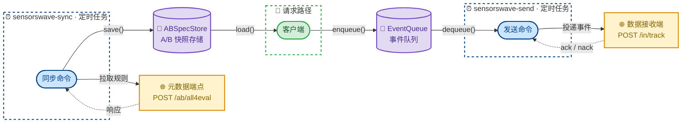
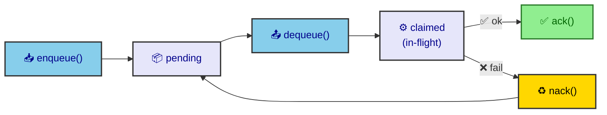

# SensorsWave PHP SDK

[English](README.md) | **中文**

轻量级 PHP SDK，用于事件埋点和 A/B 测试，专为 PHP/FPM 环境设计。

## 功能特性

- **事件埋点**：追踪用户事件，支持自定义属性
- **用户画像**：设置、累加、追加和管理用户画像属性
- **A/B 测试**：基于本地快照评估 Feature Gate、实验和 Feature Config
- **自动曝光记录**：自动追踪 A/B 测试曝光事件
- **离线运行时**：请求路径零远程 I/O — 所有网络操作均在带外执行
- **可插拔适配器**：默认使用本地文件适配器，同时支持 Redis 适配器

## 安装

```bash
composer require sensorswave/sdk-php
```

## 运行模型

PHP SDK 将请求路径逻辑与网络 I/O 分离，确保在 PHP/FPM 环境下安全运行：

- **请求路径** — `Client` 从 `ABSpecStore` 读取 A/B 快照，将埋点数据写入 `EventQueue`。无远程调用。
- **`sensorswave-sync`** — Worker 进程，拉取远程 A/B 元数据并保存快照到本地。
- **`sensorswave-send`** — Worker 进程，读取队列中的事件并投递到数据接收端。

默认情况下，SDK 使用 `sys_get_temp_dir()` 下的本地文件适配器。你可以通过实现 `RedisClientInterface` 替换为 Redis 适配器。



---

## 快速开始

### 基础事件埋点

```php
<?php

declare(strict_types=1);

use SensorsWave\Client\Client;
use SensorsWave\Model\User;

// 使用最简配置创建客户端
$client = Client::create(
    'https://your-endpoint.com',
    'your-source-token',
);

// 追踪事件
$user = new User(anonId: 'device-456', loginId: 'user-123');

$client->trackEvent($user, 'PageView', [
    'page' => '/home',
]);

$client->close();
```

### 启用 A/B 测试（可选）

启用 A/B 测试需要提供 `ABConfig`：

```php
use SensorsWave\Config\Config;
use SensorsWave\Config\ABConfig;

$config = new Config(
    ab: new ABConfig(
        projectSecret: 'your-project-secret',
    ),
);

$client = Client::create(
    'https://your-endpoint.com',
    'your-source-token',
    $config,
);

// 现在可以使用 A/B 测试方法
$result = $client->getExperiment($user, 'my_experiment');

// 从实验结果中获取参数
$btnColor = $result->getString('button_color', 'blue');
$showBanner = $result->getBool('show_banner', false);
$discount = $result->getNumber('discount_percent', 0);
```

### 带外运行 Worker

通过定时任务（如 cron）同步 A/B 快照：

```bash
./bin/sensorswave-sync <endpoint> <sourceToken> <projectSecret>
```

通过定时任务发送队列中的事件：

```bash
./bin/sensorswave-send <endpoint> <sourceToken>
```

---

## 用户类型

> **警告**
>
> ### 用户身份要求（必读）
>
> **除 `identify` 外的所有方法：**
>
> - `anonId` 或 `loginId` 至少提供一个
> - **如果同时提供，`loginId` 优先用于用户标识**
>
> **仅 `identify` 方法：**
>
> - **`anonId` 和 `loginId` 必须同时提供**
> - 该方法创建 `$Identify` 事件，关联匿名身份和登录身份

### 使用示例

**使用不同 ID 组合创建用户：**

```php
use SensorsWave\Model\User;

// 有效：仅 loginId（已登录用户）
$user = new User(loginId: 'user-123');

// 有效：仅 anonId（匿名用户）
$user = new User(anonId: 'device-456');

// 有效：同时提供（loginId 优先用于标识）
$user = new User(anonId: 'device-456', loginId: 'user-123');

// 无效：未提供任何 ID — 将会失败
$user = new User();
```

**identify 方法 — 必须同时提供两个 ID：**

```php
// 正确：同时提供两个 ID
$client->identify(new User(anonId: 'device-456', loginId: 'user-123'));

// 无效：只提供一个 ID — identify 将失败
$client->identify(new User(loginId: 'user-123')); // 缺少 anonId
```

**添加 A/B 定向属性：**

```php
$user = new User(anonId: 'device-456', loginId: 'user-123');

// 添加 A/B 定向属性（不可变模式）
$user = $user->withAbUserProperty('$app_version', '11.0');
$user = $user->withAbUserProperty('is_premium', true);

// 或批量添加
$user = $user->withAbUserProperties([
    '$app_version' => '11.0',
    'is_premium'   => true,
]);
```

---

## 事件埋点

### 关联用户身份

将匿名 ID 与登录 ID 关联（注册事件）。

```php
$user = new User(anonId: 'anon-123', loginId: 'user-456');
$client->identify($user);
```

### 追踪自定义事件

```php
$user = new User(anonId: 'anon-123', loginId: 'user-456');

$client->trackEvent($user, 'Purchase', [
    'product_id'   => 'SKU-001',
    'total_amount' => 99.99,
    'item_count'   => 2,
]);
```

### 使用完整事件结构追踪

```php
use SensorsWave\Model\Event;
use SensorsWave\Model\Properties;

$event = Event::create('anon-123', 'user-456', 'PageView')
    ->withProperties(
        Properties::create()
            ->set('page_name', '/home')
            ->set('referrer', 'google.com')
    );

$client->track($event);
```

---

## 用户画像管理

### 设置画像属性

```php
$user = new User(anonId: 'anon-123', loginId: 'user-456');

$client->profileSet($user, [
    'name'             => 'John Doe',
    'email'            => 'john@example.com',
    'membership_level' => 5,
]);
```

### 首次设置（仅在属性不存在时生效）

```php
$client->profileSetOnce($user, [
    'first_login_date' => '2026-01-20',
]);
```

### 累加数值属性

```php
$client->profileIncrement($user, [
    'login_count' => 1,
    'points'      => 100,
]);
```

### 追加列表属性

```php
use SensorsWave\Model\ListProperties;

$client->profileAppend($user, ListProperties::create()->set('tags', ['premium']));
```

### 合并列表属性（去重）

```php
$client->profileUnion($user, ListProperties::create()->set('categories', ['sports']));
```

### 删除属性

```php
$client->profileUnset($user, 'temp_field', 'old_field');
```

### 删除用户画像

```php
$client->profileDelete($user);
```

---

## A/B 测试

PHP 客户端仅从本地快照评估 A/B 测试。如果快照缺失或过期，Gate 检查将返回默认值（fail closed）。客户端在请求路径上不会回退到远程元数据刷新。

### 检查 Feature Gate

```php
$pass = $client->checkFeatureGate($user, 'new_checkout_flow');
if ($pass) {
    showNewCheckout();
} else {
    showOldCheckout();
}
```

### 获取 Feature Config 值

```php
$result = $client->getFeatureConfig($user, 'button_color_config');

// 获取带默认值的类型化值
$color   = $result->getString('color', 'blue');
$size    = $result->getNumber('size', 14.0);
$enabled = $result->getBool('enabled', false);
$items   = $result->getSlice('items', []);
$settings = $result->getMap('settings', []);
```

### 评估实验

```php
$result = $client->getExperiment($user, 'pricing_experiment');

$strategy = $result->getString('strategy', 'original');

switch ($strategy) {
    case 'original':
        showOriginalPricing();
        break;
    case 'discount':
        showDiscountPricing();
        break;
    case 'bundle':
        showBundlePricing();
        break;
}
```

---

## 完整 API 方法参考

### 生命周期管理

| 方法 | 签名 | 说明 |
|------|------|------|
| **close** | `close(): void` | 将内存中的事件刷入本地队列并关闭客户端 |
| **flush** | `flush(): void` | 将当前缓冲批次刷入本地队列，不关闭客户端 |

### 用户身份

| 方法 | 签名 | 说明 |
|------|------|------|
| **identify** | `identify(User $user): void` | 创建 `$Identify` 事件，关联匿名身份和登录身份。`anonId` 和 `loginId` 均为必填。 |

### 事件埋点

| 方法 | 签名 | 说明 |
|------|------|------|
| **trackEvent** | `trackEvent(User $user, string $eventName, array\|Properties $properties = []): void` | 追踪用户行为的主要方法，支持自定义属性 |
| **track** | `track(Event $event): void` | 底层 API，用于高级场景；常规用法请使用 `trackEvent` |

### 用户画像操作

| 方法 | 签名 | 说明 | 使用场景 |
|------|------|------|----------|
| **profileSet** | `profileSet(User $user, array\|Properties $properties): void` | 设置或覆盖画像属性 | 更新用户名、邮箱、设置 |
| **profileSetOnce** | `profileSetOnce(User $user, array\|Properties $properties): void` | 仅在属性不存在时设置 | 记录注册日期、首次来源 |
| **profileIncrement** | `profileIncrement(User $user, array\|Properties $properties): void` | 累加数值属性 | 登录次数、积分、分数 |
| **profileAppend** | `profileAppend(User $user, array\|ListProperties $properties): void` | 追加到列表属性（允许重复） | 添加购买记录、活动日志 |
| **profileUnion** | `profileUnion(User $user, array\|ListProperties $properties): void` | 向列表属性添加唯一值 | 添加兴趣、标签、分类 |
| **profileUnset** | `profileUnset(User $user, string ...$propertyKeys): void` | 删除指定属性 | 清除临时或废弃字段 |
| **profileDelete** | `profileDelete(User $user): void` | 删除整个用户画像（不可逆） | GDPR 数据删除请求 |

### A/B 测试

| 方法 | 签名 | 说明 |
|------|------|------|
| **checkFeatureGate** | `checkFeatureGate(User $user, string $key): bool` | 评估 Feature Gate。未找到或类型不匹配时返回 `false` |
| **getFeatureConfig** | `getFeatureConfig(User $user, string $key): ABResult` | 评估 Feature Config。未找到时返回空结果 |
| **getExperiment** | `getExperiment(User $user, string $key): ABResult` | 评估实验。未找到时返回空结果 |
| **evaluateAll** | `evaluateAll(User $user): array` | 评估所有已加载的规则并记录曝光 |
| **getABSpecs** | `getABSpecs(): string` | 导出当前 A/B 元数据快照为 JSON，用于缓存 |

---

## 配置选项

### 客户端配置

| 字段 | 类型 | 默认值 | 说明 |
|------|------|--------|------|
| `trackUriPath` | `string` | `/in/track` | 事件埋点端点路径 |
| `flushIntervalMs` | `int` | `10000` | 内存批次滚动间隔（毫秒） |
| `httpConcurrency` | `int` | `1` | Worker 端请求并发数 |
| `httpTimeoutMs` | `int` | `3000` | Worker 端请求超时（毫秒） |
| `httpRetry` | `int` | `2` | Worker 端重试次数 |
| `eventQueue` | `EventQueueInterface` | 本地文件队列 ⚠️ | 请求路径埋点 API 使用的队列 |
| `onTrackFailHandler` | `?callable` | `null` ⚠️ | 队列写入失败时的回调 |
| `ab` | `?ABConfig` | `null` | A/B 配置（默认禁用） |
| `transport` | `?TransportInterface` | `null` | Worker 端自定义传输层 |
| `logger` | `?LoggerInterface` | 默认日志器 ⚠️ | 自定义日志器 |

> ⚠️ **生产环境注意事项**
>
> 以下字段的默认实现仅用于本地开发和测试，**不建议在生产环境使用** — 请提供自己的实现：
>
> - **`eventQueue`** — 默认 `LocalFileEventQueue` 使用系统临时目录。在多实例或容器化部署中，每个进程拥有独立的队列，重启可能丢失数据。请替换为共享后端（如 Redis、数据库）。
> - **`onTrackFailHandler`** — 默认 `null` 静默丢弃失败。生产环境应注册回调来记录日志或告警，否则数据丢失将无法感知。
> - **`logger`** — 默认 `DefaultLogger` 仅将 `warn` 和 `error` 输出到 `error_log`，`debug` 和 `info` 被静默。请替换为你的日志框架（如 Monolog）以获得完整的可观测性。

### ABConfig

| 字段 | 类型 | 默认值 | 说明 |
|------|------|--------|------|
| `projectSecret` | `string` | `''` | 同步 Worker 使用的项目密钥 |
| `metaEndpoint` | `string` | 主端点 | 同步 Worker 的元数据端点覆盖 |
| `metaUriPath` | `string` | `/ab/all4eval` | 元数据请求路径 |
| `metaLoadIntervalMs` | `int` | `60000` | 快照新鲜度阈值（最小 `30000`） |
| `stickyHandler` | `?StickyHandlerInterface` | `null` | 粘性分流存储 |
| `loadABSpecs` | `string` | `''` | 启动时加载的快照数据 |
| `abSpecStore` | `ABSpecStoreInterface` | 本地文件存储 ⚠️ | 请求路径使用的快照存储 |

> ⚠️ **生产环境注意事项**
>
> - **`abSpecStore`** — 默认 `LocalFileABSpecStore` 将快照存储在系统临时目录。在多实例或容器化部署中，每个进程读取独立的副本，导致 A/B 评估结果不一致。请替换为共享后端（如 Redis、数据库）。

---

## 高级用法：缓存 A/B 快照

为提升启动性能，你可以缓存 A/B 规则并在客户端初始化时加载。

```php
// 1. 从已初始化的客户端获取快照
$specs = $client->getABSpecs();

// 2. 将快照保存到持久化存储（如文件、数据库、Redis）
// saveToStorage($specs);

// 3. 创建新客户端时加载快照
$savedSpecs = loadFromStorage();

$config = new Config(
    ab: new ABConfig(
        projectSecret: 'your-project-secret',
        loadABSpecs: $savedSpecs, // 注入缓存的快照
    ),
);

// 客户端将立即使用缓存的快照进行 A/B 评估
$client = Client::create('https://your-endpoint.com', 'your-source-token', $config);
```

---

## 默认适配器

SDK 内置了可插拔的适配器：

| 适配器 | 说明 |
|--------|------|
| `LocalFileABSpecStore` | 基于文件的 A/B 快照存储（默认） |
| `LocalFileEventQueue` | 基于文件的事件队列（默认） |
| `RedisABSpecStore` | 基于 Redis 的 A/B 快照存储 |
| `RedisEventQueue` | 基于 Redis 的事件队列 |

Redis 适配器依赖 `RedisClientInterface`，因此你可以将 SDK 接入你偏好的 Redis 扩展或客户端库，而不引入硬依赖。

> **注意**：内置的 `LocalFile*` 和 `Redis*` 适配器（`LocalFileABSpecStore`、`LocalFileEventQueue`、`RedisABSpecStore`、`RedisEventQueue`）均为**参考实现**，仅供参考。它们可能不适合所有生产环境。请根据项目需求评估，并自行适配或实现新的 `ABSpecStoreInterface` / `EventQueueInterface`。详见下方[自定义适配器](#自定义适配器)。

---

## 自定义适配器

如果内置的文件/Redis 适配器不适合你的基础设施，可以通过实现两个接口来自定义：`ABSpecStoreInterface` 和 `EventQueueInterface`。

### ABSpecStoreInterface

管理 A/B 快照的持久化存储。同步 Worker 调用 `save()` 写入，请求路径客户端调用 `load()` 读取。

```php
use SensorsWave\Contract\ABSpecStoreInterface;

interface ABSpecStoreInterface
{
    /**
     * 加载最近保存的快照 JSON 字符串。
     * 无数据时返回 null — SDK 将跳过 A/B 评估。
     */
    public function load(): ?string;

    /**
     * 持久化快照 JSON 字符串（由同步 Worker 调用，不在请求路径上执行）。
     */
    public function save(string $snapshot): void;
}
```

**实现注意事项：**

- `load()` 必须返回传给 `save()` 的原始字符串 — 不要重新编码或转换
- 实现必须是进程安全的 — 请求路径的 FPM 进程和同步 Worker 可能并发读写

### EventQueueInterface

管理请求路径和发送 Worker 之间的事件缓冲，采用基于认领的投递模型：



```php
use SensorsWave\Contract\EventQueueInterface;
use SensorsWave\Storage\EventBatch;

interface EventQueueInterface
{
    /**
     * 将事件数组写入队列。
     * 在请求路径上调用 — 应尽快返回。
     *
     * @param list<array<string, mixed>> $events
     */
    public function enqueue(array $events): void;

    /**
     * 弹出最多 $maxItems 个事件作为一个批次。
     * 批次应标记为"已认领"以防止重复消费。
     * 队列为空时返回 null。
     */
    public function dequeue(int $maxItems): ?EventBatch;

    /**
     * 确认投递成功 — 移除已认领的批次。
     */
    public function ack(string $batchId): void;

    /**
     * 投递失败 — 将批次退回队列以便重试。
     */
    public function nack(string $batchId): void;
}
```

**实现注意事项：**

- `enqueue()` 在 PHP-FPM 请求处理中运行 — 避免昂贵的 I/O（网络往返、同步磁盘刷写等）
- `dequeue()` 返回包含 `batchId`（唯一标识）和 `events` 数组的 `EventBatch`
- 已认领的批次应有过期机制（如 Redis 中的 TTL、数据库中的定时清理），以便 Worker 崩溃时自动恢复
- `ack()` / `nack()` 对每个 `batchId` 最多调用一次

### 接入自定义适配器

通过 `Config` 和 `ABConfig` 构造函数传入你的实现：

```php
use SensorsWave\Client\Client;
use SensorsWave\Config\Config;
use SensorsWave\Config\ABConfig;

$client = Client::create(
    'https://your-endpoint.com',
    'your-source-token',
    new Config(
        eventQueue: new YourEventQueue(/* ... */),
        ab: new ABConfig(
            projectSecret: 'your-project-secret',
            abSpecStore:   new YourABSpecStore(/* ... */),
        ),
    ),
);
```

> **重要**：请求路径客户端和对应的 Worker 必须共享同一存储后端：
> - `ABSpecStoreInterface` — 由 `sensorswave-sync` 写入，请求路径客户端读取
> - `EventQueueInterface` — 由请求路径客户端写入，`sensorswave-send` 读取

---

## 运行示例

事件埋点 / 身份关联 / 画像设置示例：

```bash
php example/track_example.php \
    --source-token=your_token \
    --endpoint=your_event_tracking_endpoint
```

A/B 测试示例：

```bash
php example/ab_example.php \
    --source-token=your_token \
    --project-secret=your_secret \
    --endpoint=your_event_tracking_endpoint \
    --gate-key=my_feature_gate \
    --experiment-key=my_experiment \
    --feature-config-key=my_feature_config
```

---

## 开发

```bash
vendor/bin/phpunit
vendor/bin/phpstan analyse
```

## 环境要求

- PHP ^8.2
- 无外部生产依赖

## 许可证

详见 LICENSE 文件。
